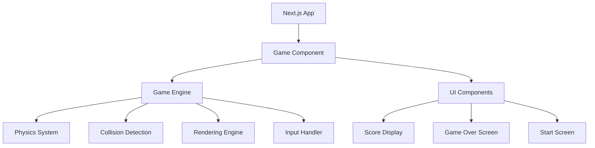

# Flappy Bird Game Design Document

## Overview

The Flappy Bird game will be implemented as a Next.js application using HTML5 Canvas for rendering and React hooks for state management. The game will feature real-time physics simulation, collision detection, and smooth animations running at 60 FPS. The architecture will be modular, separating game logic, rendering, and state management for maintainability and testability.

## Architecture

### High-Level Architecture



### Technology Stack

- **Framework**: Next.js 14+ with App Router
- **Rendering**: HTML5 Canvas API
- **State Management**: React useState and useEffect hooks
- **Animation**: requestAnimationFrame for smooth 60 FPS gameplay
- **Styling**: Tailwind CSS for UI components
- **Physics**: Custom lightweight physics engine for gravity and movement

## Components and Interfaces

### Core Game Components

#### 1. GameCanvas Component
- **Purpose**: Main game rendering surface
- **Responsibilities**: 
  - Canvas setup and context management
  - Game loop orchestration
  - Event handling for user input
- **Props**: `width`, `height`, `onGameOver`, `onScoreUpdate`

#### 2. GameEngine Class
- **Purpose**: Core game logic and state management
- **Methods**:
  - `start()`: Initialize game state
  - `update(deltaTime)`: Update game physics and positions
  - `render(context)`: Draw all game objects
  - `handleInput()`: Process user input
  - `checkCollisions()`: Detect bird-obstacle collisions
  - `reset()`: Reset game to initial state

#### 3. Bird Class
- **Purpose**: Represents the player-controlled bird
- **Properties**:
  - `x, y`: Position coordinates
  - `velocityY`: Vertical velocity
  - `width, height`: Collision bounds
- **Methods**:
  - `update(deltaTime)`: Apply gravity and update position
  - `jump()`: Apply upward velocity
  - `render(context)`: Draw bird sprite
  - `getBounds()`: Return collision rectangle

#### 4. Obstacle Class
- **Purpose**: Represents pipe obstacles
- **Properties**:
  - `x`: Horizontal position
  - `gapY`: Vertical position of gap center
  - `gapHeight`: Height of passable gap
  - `width`: Obstacle width
  - `passed`: Boolean indicating if bird has passed
- **Methods**:
  - `update(deltaTime)`: Move obstacle leftward
  - `render(context)`: Draw top and bottom pipes
  - `getBounds()`: Return collision rectangles for both pipes
  - `isOffScreen()`: Check if obstacle should be removed

#### 5. UI Components
- **ScoreDisplay**: Shows current score in top-right corner
- **GameOverScreen**: Displays final score and restart button
- **StartScreen**: Initial game screen with play button

### Game State Interface

```typescript
interface GameState {
  isPlaying: boolean;
  isGameOver: boolean;
  score: number;
  bird: Bird;
  obstacles: Obstacle[];
  lastTime: number;
}
```

### Configuration Constants

```typescript
const GAME_CONFIG = {
  CANVAS_WIDTH: 800,
  CANVAS_HEIGHT: 600,
  BIRD_GRAVITY: 0.5,
  BIRD_JUMP_FORCE: -8,
  BIRD_SIZE: 30,
  OBSTACLE_WIDTH: 60,
  OBSTACLE_GAP: 150,
  OBSTACLE_SPEED: 2,
  OBSTACLE_SPAWN_DISTANCE: 300
};
```

## Data Models

### Bird Model
- **Position**: x, y coordinates (numbers)
- **Velocity**: velocityY for vertical movement (number)
- **Dimensions**: width, height for collision detection (numbers)
- **State**: alive status (boolean)

### Obstacle Model
- **Position**: x coordinate for horizontal position (number)
- **Gap Configuration**: gapY (center), gapHeight (size) (numbers)
- **Dimensions**: width for collision bounds (number)
- **Status**: passed flag for scoring (boolean)

### Game State Model
- **Game Status**: isPlaying, isGameOver (booleans)
- **Score**: current score (number)
- **Entities**: bird object, obstacles array
- **Timing**: lastTime for delta calculations (number)

## Error Handling

### Canvas Rendering Errors
- **Strategy**: Graceful degradation with error boundaries
- **Implementation**: Try-catch blocks around canvas operations
- **Fallback**: Display error message if canvas is not supported

### Game Loop Errors
- **Strategy**: Error recovery without crashing the game
- **Implementation**: Catch errors in update/render cycles
- **Recovery**: Reset game state if critical error occurs

### Input Handling Errors
- **Strategy**: Ignore invalid inputs, continue game operation
- **Implementation**: Validate input events before processing
- **Logging**: Console warnings for debugging

### Performance Issues
- **Strategy**: Frame rate monitoring and adjustment
- **Implementation**: Track frame times and adjust game speed if needed
- **Fallback**: Reduce visual effects if performance is poor

## Testing Strategy

### Unit Testing
- **Bird Physics**: Test gravity, jumping, and position updates
- **Collision Detection**: Verify accurate collision boundaries
- **Obstacle Generation**: Test random height generation and movement
- **Score Calculation**: Verify scoring logic when passing obstacles

### Integration Testing
- **Game Loop**: Test complete update-render cycle
- **State Transitions**: Test game start, play, and game over states
- **Input Response**: Test keyboard and mouse input handling
- **UI Updates**: Test score display and game over screen

### Performance Testing
- **Frame Rate**: Ensure consistent 60 FPS performance
- **Memory Usage**: Monitor for memory leaks in game loop
- **Canvas Operations**: Test rendering performance with multiple obstacles

### User Experience Testing
- **Responsiveness**: Test input lag and game responsiveness
- **Visual Quality**: Verify smooth animations and clear graphics
- **Game Balance**: Test difficulty progression and obstacle spacing

### Browser Compatibility Testing
- **Canvas Support**: Test across different browsers
- **Performance**: Verify consistent performance across platforms
- **Input Methods**: Test both keyboard and mouse controls

## Implementation Considerations

### Performance Optimizations
- Use object pooling for obstacles to reduce garbage collection
- Implement efficient collision detection using bounding boxes
- Optimize canvas rendering by only drawing visible elements
- Use requestAnimationFrame for smooth animation timing

### Accessibility
- Provide keyboard controls (spacebar) as alternative to mouse clicks
- Include visual feedback for all interactions
- Ensure sufficient color contrast for UI elements
- Add screen reader support for score announcements

### Mobile Responsiveness
- Design touch-friendly controls for mobile devices
- Implement responsive canvas sizing
- Optimize performance for mobile browsers
- Consider device orientation changes

### Code Organization
- Separate game logic from React components
- Use TypeScript for type safety and better development experience
- Implement proper error boundaries for React components
- Follow Next.js best practices for file organization