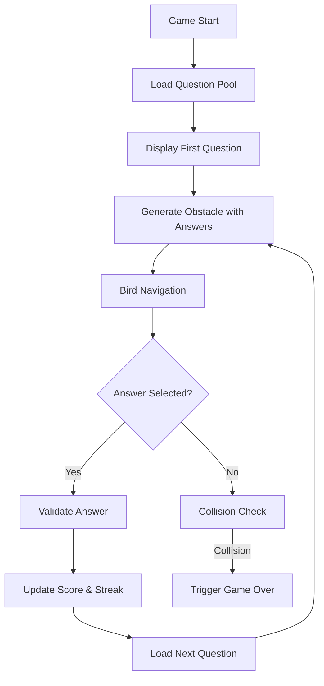

# Design Document

## Overview

The Math Bird transformation converts the existing Flappy Bird game into an educational math game that combines classic game-over mechanics with a continuous math-based scoring system. The design maintains the core physics and visual elements while introducing a math question system, dual-path obstacle navigation, and dynamic scoring with streak bonuses.

## Architecture

### Core Components

The transformation leverages the existing game architecture with strategic modifications:

- **GameEngine**: Integrates the math question lifecycle and scoring system
- **Obstacle**: Extended to include dual answer zones and visual answer displays
- **New MathQuestionManager**: Handles question pool, selection, and validation
- **New ScoringSystem**: Manages points, streaks, and bonus calculations
- **Enhanced UI**: Question display and answer choice rendering

### Data Flow



## Components and Interfaces

### MathQuestionManager

```typescript
interface MathQuestion {
  id: string;
  category: 'addition' | 'subtraction' | 'multiplication' | 'division';
  question: string;
  correctAnswer: number;
  difficulty: number;
}

interface QuestionPool {
  available: MathQuestion[];
  used: MathQuestion[];
}

class MathQuestionManager {
  private questionPool: QuestionPool;
  private currentQuestion: MathQuestion | null;
  
  public loadQuestions(): void;
  public getNextQuestion(): MathQuestion;
  public validateAnswer(answer: number): boolean;
  public resetPool(): void;
}
```

### Enhanced Obstacle System

```typescript
interface AnswerZone {
  bounds: Bounds;
  answer: number;
  isCorrect: boolean;
  position: 'upper' | 'lower';
}

class MathObstacle extends Obstacle {
  private upperAnswerZone: AnswerZone;
  private lowerAnswerZone: AnswerZone;
  private question: MathQuestion;
  
  public setupAnswerZones(question: MathQuestion): void;
  public checkAnswerSelection(birdBounds: Bounds): AnswerZone | null;
  public renderAnswerChoices(context: CanvasRenderingContext2D): void;
}
```

### Scoring System

```typescript
interface ScoreState {
  points: number;
  streak: number;
  totalCorrect: number;
  totalIncorrect: number;
}

class ScoringSystem {
  private scoreState: ScoreState;
  
  public processCorrectAnswer(): number;
  public processIncorrectAnswer(): number;
  public calculateStreakBonus(): number;
  public getScoreState(): ScoreState;
}
```

### Enhanced GameEngine

```typescript
class MathGameEngine extends GameEngine {
  private mathQuestionManager: MathQuestionManager;
  private scoringSystem: ScoringSystem;
  private currentQuestion: MathQuestion | null;
  
  protected handleAnswerSelection(answer: number): void;
  protected generateMathObstacle(): MathObstacle;
  // Note: handleCollision() maintains original game-over behavior
}
```

## Data Models

### Question Database Structure

```typescript
const QUESTION_DATABASE: MathQuestion[] = [
  // Addition (50 questions)
  { id: 'add_001', category: 'addition', question: '2 + 3', correctAnswer: 5, difficulty: 1 },
  { id: 'add_002', category: 'addition', question: '7 + 4', correctAnswer: 11, difficulty: 1 },
  // ... more addition questions
  
  // Subtraction (50 questions)
  { id: 'sub_001', category: 'subtraction', question: '8 - 3', correctAnswer: 5, difficulty: 1 },
  // ... more subtraction questions
  
  // Multiplication (50 questions)
  { id: 'mul_001', category: 'multiplication', question: '3 × 4', correctAnswer: 12, difficulty: 2 },
  // ... more multiplication questions
  
  // Division (50 questions)
  { id: 'div_001', category: 'division', question: '12 ÷ 3', correctAnswer: 4, difficulty: 2 }
  // ... more division questions
];
```

### Answer Generation Logic

For each question, the system generates one incorrect answer using these strategies:
- **Addition/Subtraction**: ±1 to ±3 from correct answer
- **Multiplication**: Common multiplication errors (e.g., 3×4=11 instead of 12)
- **Division**: Off-by-one errors or remainder confusion

### Visual Layout

```
┌─────────────────────────────────────┐
│           Question: 7 + 4           │ ← Top-center question display
├─────────────────────────────────────┤
│                                     │
│     ┌─────┐              ┌─────┐    │
│     │ 11  │ ← Upper      │     │    │ ← Upper answer zone
│     └─────┘   Answer     │     │    │
│                          │     │    │
│     ═══════════════════  │     │    │ ← Horizontal separator
│                          │     │    │
│     ┌─────┐              │     │    │
│     │ 12  │ ← Lower      │     │    │ ← Lower answer zone
│     └─────┘   Answer     │     │    │
│                          └─────┘    │
│                                     │
└─────────────────────────────────────┘
```

## Error Handling

### Answer Selection Error Handling

```typescript
interface AnswerValidation {
  validateCorrectAnswer(): void;
  handleIncorrectAnswer(): void;
  updateStreakAndScore(): void;
}

class AnswerHandler implements AnswerValidation {
  public validateCorrectAnswer(): void {
    // Award 10 points and increment streak
    scoringSystem.addPoints(10);
    scoringSystem.incrementStreak();
  }
  
  public handleIncorrectAnswer(): void {
    // Deduct 5 points (minimum 0) and reset streak
    scoringSystem.subtractPoints(5);
    scoringSystem.resetStreak();
  }
}
```

### Question Management Error Handling

- **Empty Pool Recovery**: Automatically reshuffle used questions back to available
- **Invalid Question Data**: Skip malformed questions and log errors
- **Answer Generation Failure**: Provide fallback incorrect answers

## Testing Strategy

### Unit Tests

1. **MathQuestionManager Tests**
   - Question pool initialization and management
   - Random question selection without immediate repeats
   - Pool reset and reshuffle functionality
   - Answer validation accuracy

2. **ScoringSystem Tests**
   - Correct answer scoring (+10 points)
   - Incorrect answer penalty (-5 points, minimum 0)
   - Streak tracking and bonus calculation
   - Score state persistence

3. **MathObstacle Tests**
   - Answer zone positioning and collision detection
   - Visual rendering of answer choices
   - Random answer placement (upper/lower)

4. **AnswerHandler Tests**
   - Correct answer scoring and streak increment
   - Incorrect answer penalty and streak reset
   - Score boundary conditions (minimum 0)

### Integration Tests

1. **Complete Question Lifecycle**
   - Question display → obstacle generation → answer selection → score update → next question
   - Verify no race conditions between question loading and obstacle appearance

2. **Game Over Flow**
   - Physical collision → game over state
   - Ensure traditional collision mechanics are preserved

3. **Streak Bonus System**
   - Achieve 5 correct answers → verify 50-point bonus
   - Incorrect answer → verify streak reset

### End-to-End Tests

1. **Complete Gameplay Session**
   - Play through multiple questions across all categories
   - Verify question pool management over extended play
   - Verify that any physical collision correctly triggers the game-over screen and final score display

2. **Performance Testing**
   - Ensure smooth rendering with answer displays
   - Verify no memory leaks from question management
   - Test responsiveness with 200-question database

## Implementation Considerations

### Performance Optimizations

- **Question Pool Management**: Use efficient array operations for question shuffling
- **Answer Zone Collision**: Optimize collision detection for dual-zone obstacles
- **Visual Rendering**: Cache answer text rendering to improve performance

### Accessibility

- **High Contrast**: Ensure answer choices are clearly visible against obstacle backgrounds
- **Font Size**: Use large, legible fonts for math questions and answers
- **Color Coding**: Consider color-blind friendly indicators for correct/incorrect feedback

### Mobile Responsiveness

- **Touch Zones**: Ensure answer zones are large enough for touch navigation
- **Question Display**: Scale question text appropriately for smaller screens
- **Performance**: Optimize for mobile rendering capabilities

This design maintains the engaging gameplay of Flappy Bird while transforming it into an effective educational tool that promotes learning through immediate feedback and streak-based motivation.